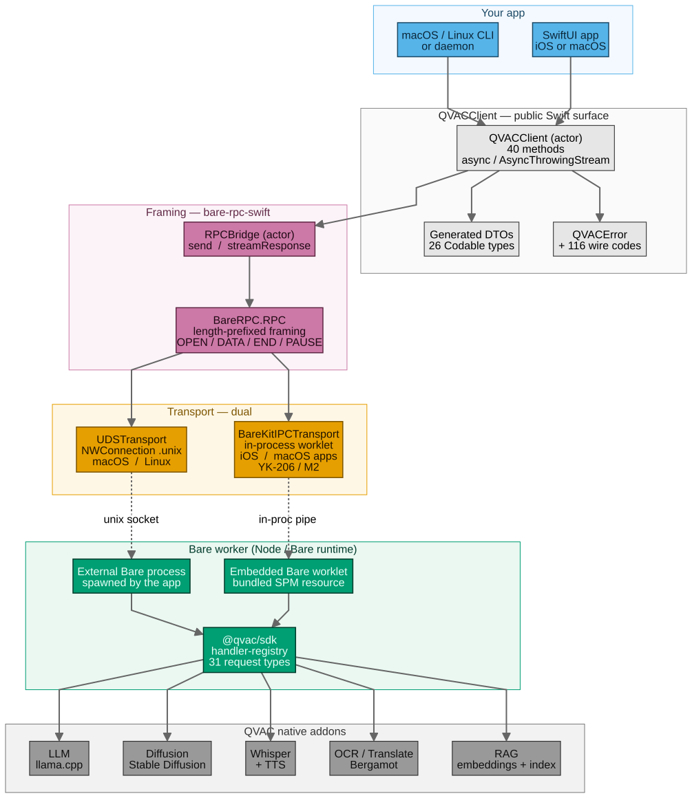

# QVACClient — native Swift client for Tether's QVAC SDK

<!-- The badge URL resolves once the repo is pushed under its final org/name.
     Placeholder for now; tracked by YK-227 (proposal) / YK-229 (submit). -->
[](https://github.com/qvac-swift/QVACClient/actions/workflows/ci.yml)

A Swift Package Manager library that gives macOS and iOS apps first-class, type-safe access
to the [QVAC SDK](https://github.com/tetherto/qvac)'s on-device AI capabilities — text
completion, embeddings, transcription, translation, text-to-speech, OCR, diffusion, RAG,
and custom plugins — without going through React Native or a JS bridge.

> **Status: M1 complete.** 17 canonical M1 issues green, full DoD met,
> tag `v0.1.0-m1` prepared and held until the bounty application is
> accepted (YK-227 / YK-229). Read [`docs/m1-summary.md`](./docs/m1-summary.md)
> for the reviewer-facing handoff (deliverables × evidence × commit
> references). M2 and M3 remain.
> Tracking issue range: **YK-174 → YK-229** (17 M1 canonical + 5 duplicate IDs, 16 M2, 13 M3, 5 application).

## Plan

| Milestone | Target | Headline deliverables |
| --- | --- | --- |
| **M1** | 2026-05-25 | Code-gen pipeline + IPC transport (UDS + Bare-kit); `loadModel`/`unloadModel`/`heartbeat`/`embed` working against a real Bare worker fixture. |
| **M2** | 2026-06-08 | Full method surface (completion + streaming, transcribe/transcribeStream, translate, ocr, diffusion/upscale, textToSpeech/Stream, lifecycle). |
| **M3** | 2026-06-22 | RAG (9 ops) + plugins, DocC catalog + tutorials, SwiftUI example app, Swift Package Index listing, v0.1.0 release. |

## Architecture



Six layers, top to bottom:

1. **Your app** — `import QVACClient`. Works from a CLI, daemon, or SwiftUI app on macOS / iOS.
2. **QVACClient public surface** — actor with 40 async methods, 26 generated `Codable` DTOs, `QVACError` mapping 116 wire codes.
3. **Framing** — `RPCBridge` adapts [`bare-rpc-swift`](https://github.com/holepunchto/bare-rpc-swift) into Swift `async`/`await` + `AsyncThrowingStream`. Pinned at commit `3983622` (includes the bidirectional-streams PR #16). Frame layout documented in [`docs/bare-rpc-wire-protocol.md`](./docs/bare-rpc-wire-protocol.md).
4. **Transport (dual)** — `UDSTransport` (Network.framework `NWConnection .unix`, macOS+Linux/CLI contexts); `BareKitIPCTransport` (in-process worklet via `holepunchto/bare-kit-swift`, iOS+macOS app contexts; lands in M2/YK-206). Both implement the same `Transport` protocol so the layers above don't care which is in use.
5. **Bare worker** — `@qvac/sdk` running on the Bare runtime. External process when paired with UDS, embedded worklet (bundled SPM resource) when paired with BareKit. Dispatches by string `request.type`; per-method wire shapes documented in [`docs/qvac-sdk-internals.md`](./docs/qvac-sdk-internals.md).
6. **QVAC native addons** — LLM (llama.cpp), Diffusion, Whisper + TTS, OCR + Bergamot translate, RAG. Upstream; we don't touch these.

Diagram source + Mermaid version: [`docs/diagrams/`](./docs/diagrams/).

## Public API target

The Swift surface is a faithful (and idiomatically async/await + actor-based) port of
[the @qvac/sdk method list](https://docs.qvac.tether.io/sdk/api/):

`completion`, `embed`, `transcribe`, `transcribeStream`, `textToSpeech`, `textToSpeechStream`,
`translate`, `ocr`, `diffusion`, `upscale`, `loadModel`, `unloadModel`, `heartbeat`,
`getModelInfo`, `getLoadedModelInfo`, `deleteCache`, `cancel`, `loggingStream`,
`ragIngest`, `ragSearch`, `ragChunk`, `ragSaveEmbeddings`, `ragDeleteEmbeddings`,
`ragReindex`, `ragListWorkspaces`, `ragCloseWorkspace`, `ragDeleteWorkspace`,
`invokePlugin`, `invokePluginStream`, `modelRegistryList`, `modelRegistrySearch`,
`modelRegistryGetModel`, `suspend`, `resume`, `state`, `startQVACProvider`, `stopQVACProvider`,
`finetune`, `downloadAsset`, `close`.

## Documentation

- **[`docs/m1-summary.md`](./docs/m1-summary.md)** — M1 reviewer-facing handoff:
  deliverables × evidence × issue crosswalk × verification artifacts. Start here if
  you're reviewing the milestone.
- **[`docs/qvac-sdk-internals.md`](./docs/qvac-sdk-internals.md)** — full SDK wire model:
  request type registry (31 handlers), error code tables (4 ranges, 128 codes), `__init_config`
  handshake, per-method request/response shapes.
- **[`docs/bare-rpc-wire-protocol.md`](./docs/bare-rpc-wire-protocol.md)** — byte-level frame
  layout, OPEN handshake, PAUSE/RESUME backpressure, end-of-stream vs destroy semantics,
  byte-exact hex fixtures.
- **[`docs/dependencies.md`](./docs/dependencies.md)** — pin policy for SPM/npm deps,
  swift-format & Node version requirements.
- **[`docs/codegen.md`](./docs/codegen.md)** — how to run the codegen pipeline; recovery
  steps when CI's drift check fires.
- **[`docs/codegen-deferred.md`](./docs/codegen-deferred.md)** — the deferred set of SDK
  types routed through `AnyCodable` in M1; drained by M2/M3 codegen passes.

## Building locally

```bash
swift --version       # expects 5.10+
swift build           # zero warnings
swift test            # smoke + doc-baseline tests
```

## License

Apache-2.0 (matches QVAC and Holepunch upstream). See [LICENSE](./LICENSE) and [NOTICE](./NOTICE).
