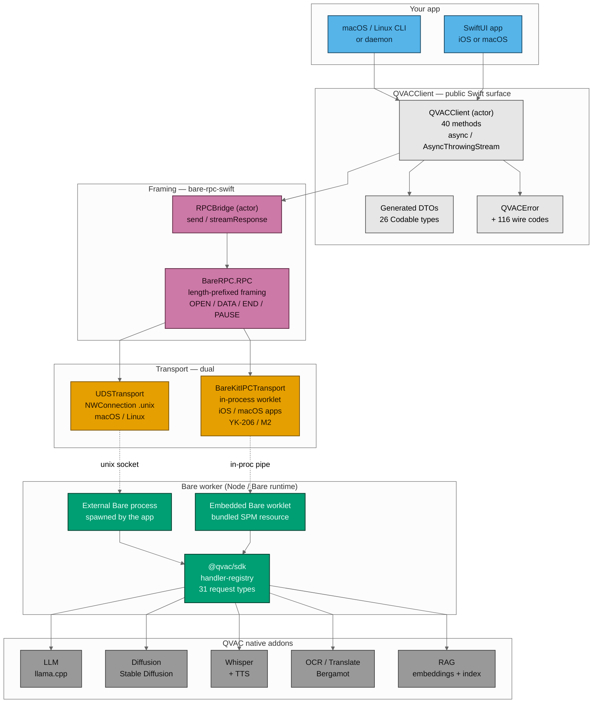

# Architecture diagram

Source of truth: [`architecture.mmd`](./architecture.mmd) (Mermaid).
Rendered exports — re-generated on every commit that touches the source:

| Format | Use | File |
| --- | --- | --- |
| **SVG** (transparent bg) | README, DocC catalog, application Notion doc | [`architecture.svg`](./architecture.svg) |
| **PNG 1600×N** (white bg) | Bounty application form, slide decks, chat previews | [`architecture.png`](./architecture.png) |
| **Mermaid source** | This page (renders inline on GitHub) | below |

## Inline render

GitHub renders Mermaid natively in `.md` files, so the source below stays
in lock-step with the rendered exports.



## Layer guide

| # | Layer | What lives here | Status |
| --- | --- | --- | --- |
| 1 | **Your app** — CLI, daemon, SwiftUI app | The caller. Just `import QVACClient`. | n/a |
| 2 | **QVACClient public surface** | 40 async methods + 26 generated `Codable` DTOs + `QVACError` (116 wire codes mapped) | M1: surface complete; M2: bodies wired through to RPCBridge |
| 3 | **Framing — bare-rpc-swift** | `RPCBridge` actor adapts `BareRPC.RPC` (length-prefixed frames + OPEN/DATA/END/PAUSE stream flags) into async/await and `AsyncThrowingStream` | M1 shipped |
| 4 | **Transport — dual** | `UDSTransport` (Network.framework `NWConnection .unix`, macOS+Linux); `BareKitIPCTransport` (in-process worklet via `holepunchto/bare-kit-swift`, iOS+macOS apps) — both implement the same `Transport` protocol so M2/M3 code paths are platform-agnostic | UDS shipped in M1 (YK-184); BareKit lands in M2 (YK-206) |
| 5 | **Bare worker** | The QVAC SDK running on Bare runtime. External process (spawned by your app) when paired with UDS; embedded worklet (bundled SPM resource) when paired with BareKit | M1: PING fixture for IPC tests; M2: real worker (YK-208) bundled as resource (YK-207) |
| 6 | **QVAC native addons** | LLM (llama.cpp), Diffusion (Stable Diffusion), Whisper + TTS, OCR + Bergamot translation, RAG embeddings | Upstream — we don't touch these |

## Re-generating exports

```bash
npx -p @mermaid-js/mermaid-cli@10.9.1 mmdc \
  -i docs/diagrams/architecture.mmd \
  -o docs/diagrams/architecture.svg \
  -b transparent

npx -p @mermaid-js/mermaid-cli@10.9.1 mmdc \
  -i docs/diagrams/architecture.mmd \
  -o docs/diagrams/architecture.png \
  -b white -w 1600
```

Pin `@mermaid-js/mermaid-cli@10.9.1` so SVG byte-output is reproducible
across hosts (matches the codegen idempotency stance from YK-182).
